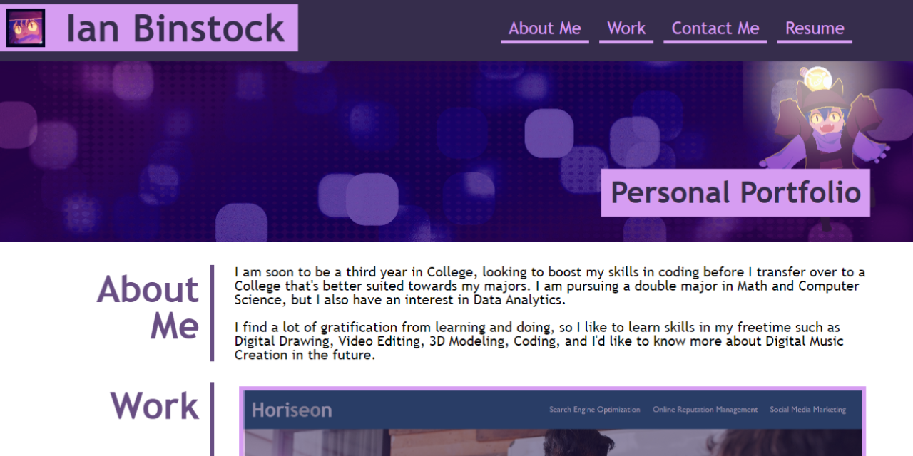

# Advanced-CSS-Portfolio

## Description

This is the 'Module 02' challenge assignment for the UCF coding bootcamp.

We were tasked with creating a web application for our portfolio from scratch. As we start to have more projects under our belts, I will only highlight my best works to showcase on my portfolio.

## Installation

1. Copy the SSH URL
2. Open a terminal, navigate to the path where you want to open the code, and then enter into the terminal 'git clone [ssh url]'
3. ?
4. Profit

## Usage

You can install Visual Studio Code and get the 'Live Server' extension if you want to test it out in a web browser, otherwise you can just follow this [link](https://binnyboy1.github.io/Advanced-CSS-Portfolio/). Clicking on Navigation tabs located in the top right, or clicking on the Project boxes will take you to the designated places. Some of the contents within the Contact Me section also serve as hyperlinks.